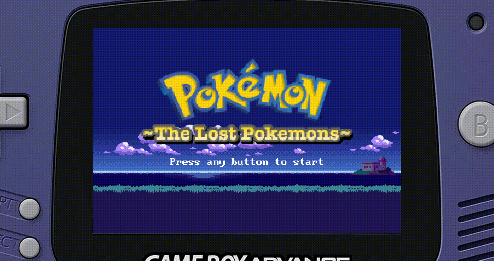
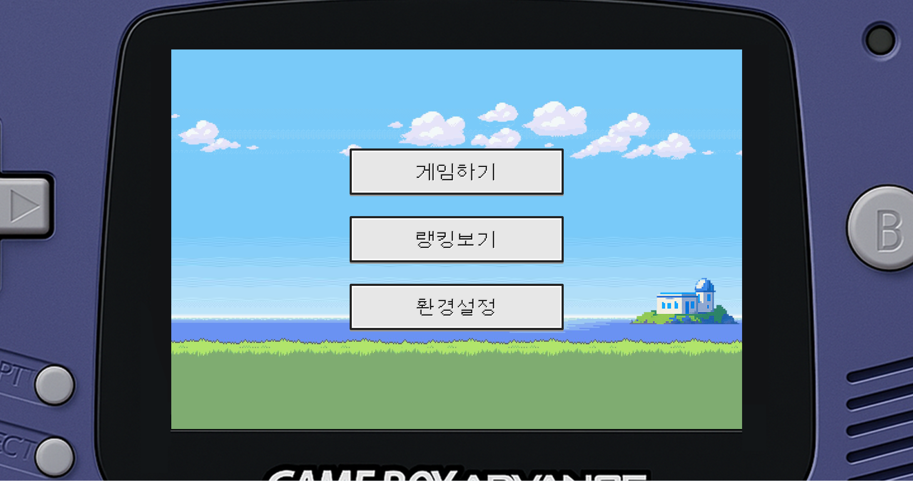
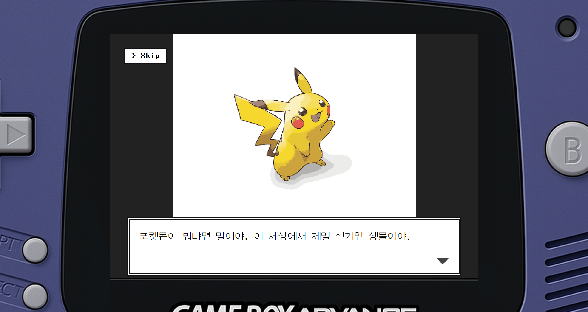
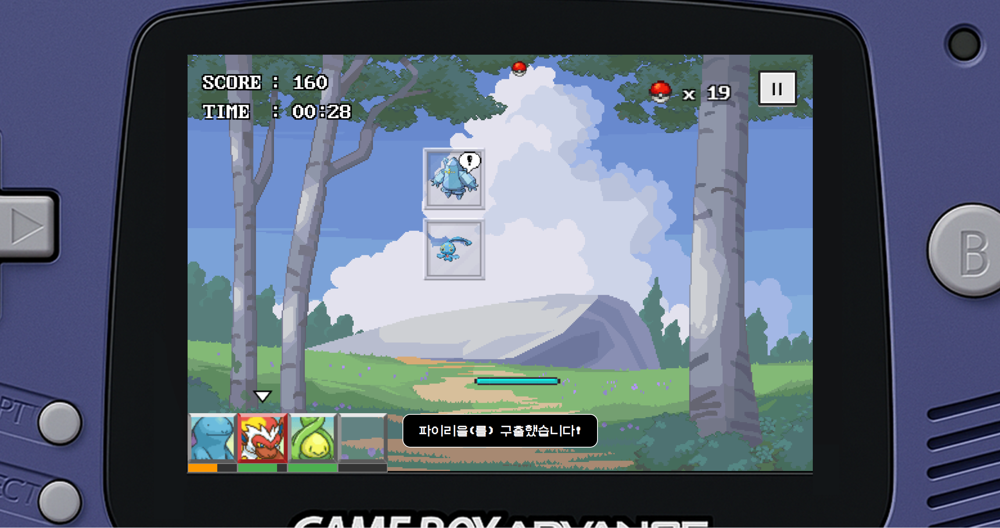
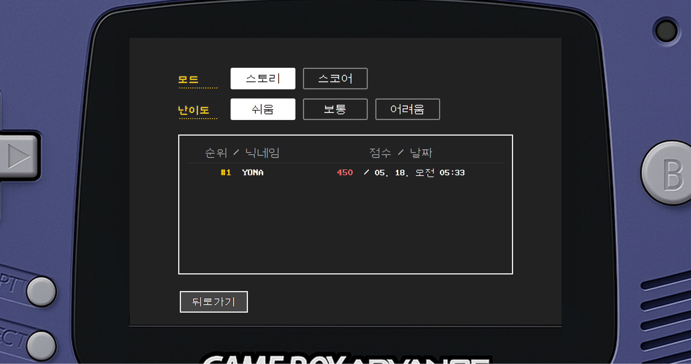
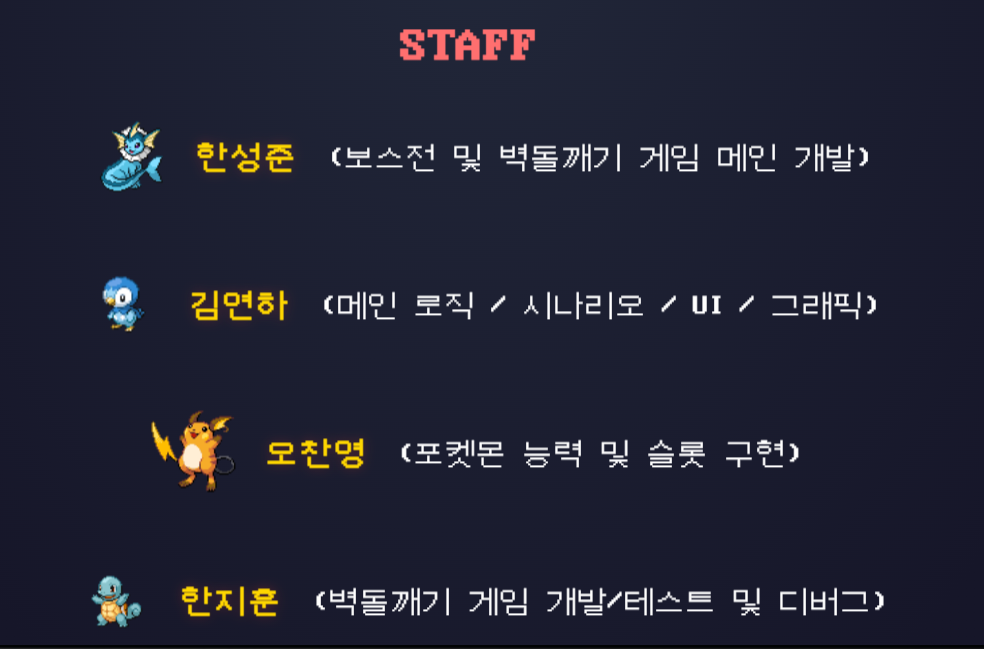

# The Lost Pokémons

Web-based Brick Breaker Fan Game (Educational / Non-Commercial)

A team-built web game created for the Web Programming course at Konkuk University (Prof. So-young Park).
Inspired by the classic brick-breaker genre and an original story set in a Pokémon-like universe.

* Development Period: May 2025 – June 2025

## Live Demo
GitHub Pages: https://yonaim.github.io/The-Lost-Pokemons/

## Screenshots / GIF

### Gameplay GIF

## Overview
The Lost Pokémons is a browser game that combines brick-breaking gameplay with story scenes. Players navigate menus with the mouse, progress through story-driven scenes in Story Mode, or compete for high scores in Score-Attack Mode.

## Tech Stack
- HTML
- CSS
- JavaScript

## Features
- Story Mode with scene-based storytelling (dialogue + illustration)
- Score-Attack Mode for high-score competition
- Brick-breaker gameplay loop (paddle/ball/bricks)
- Ranking board with persistent score storage
- UI/UX polish for smoother flow and readability

## My Contributions (Yeonha Kim)

I focused on the scene/UI layer, ranking system, and overall polish, as well as narrative and art assets.

- Creative (Story / Illustration / Music)
  - Wrote and organized the original story to fit scene-by-scene progression
  - Produced/edited illustrations and integrated them into the scene UI
  - Curated music/sound assets (some copyrighted resources were used strictly for educational, non-commercial purposes)

- Scene / UI
  - Implemented story scene flow (dialogue + illustration layout) and menu-driven navigation
  - Implemented scene transitions based on user input (e.g., next/back/skip as available in the project)
  - Improved readability and pacing through layout and UI adjustments

- Ranking system
  - Implemented a local leaderboard UI
  - Implemented score persistence using LocalStorage (save/load)
  - Implemented sorting (descending) and basic input handling for player names (e.g., empty/length constraints as applied)

- Polish / UX
  - Refined user flow and reduced friction across menus and scenes
  - Performed bug fixes and gameplay/UX stabilization tasks

## How to Run Locally
1. Clone the repository
2. Open `index.html` in your web browser

Note: Public deployment is available via GitHub Pages (see Live Demo).

## Team

- Seongjun Han (한성준) — Boss stage & brick-breaker core development
- Yeonha Kim (김연하) — Main logic, scenario, UI, graphics
- Chanyeong Oh (오찬영) — Pokémon abilities & slot system
- Jihoon Han (한지훈) — Brick-breaker development, testing & debugging

## Copyright
All Pokémon-related images and sounds are copyright © Nintendo, Creatures Inc., and GAME FREAK inc.  
This project is for educational and non-commercial purposes only, and has no affiliation with the official Pokémon franchise or its rights holders.
